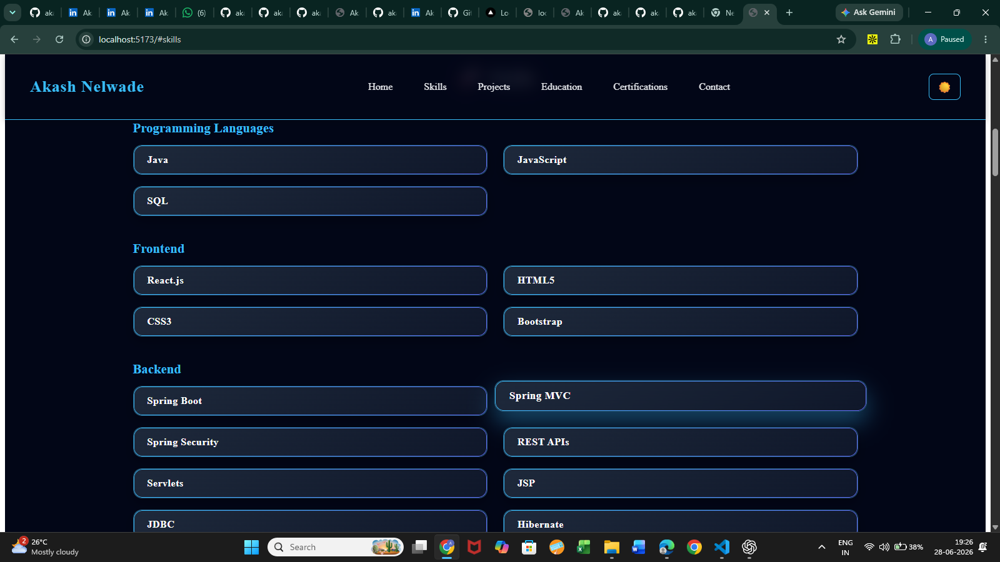
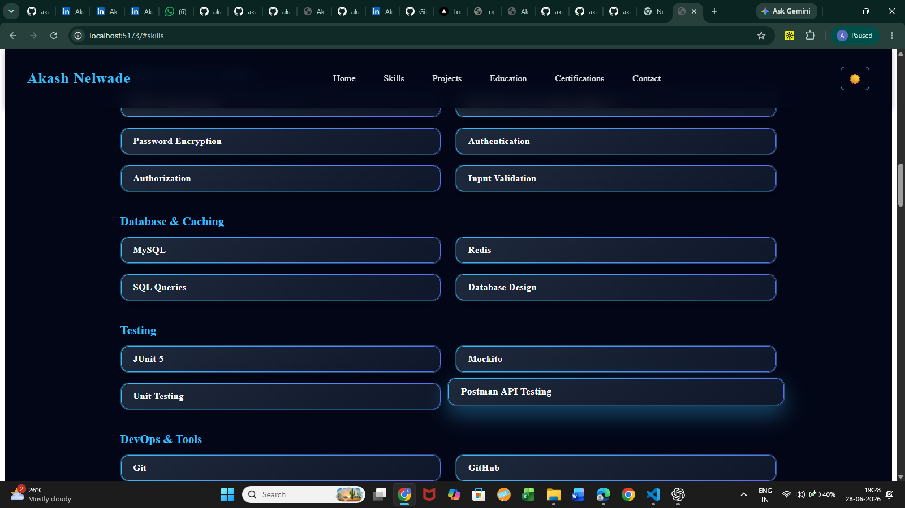
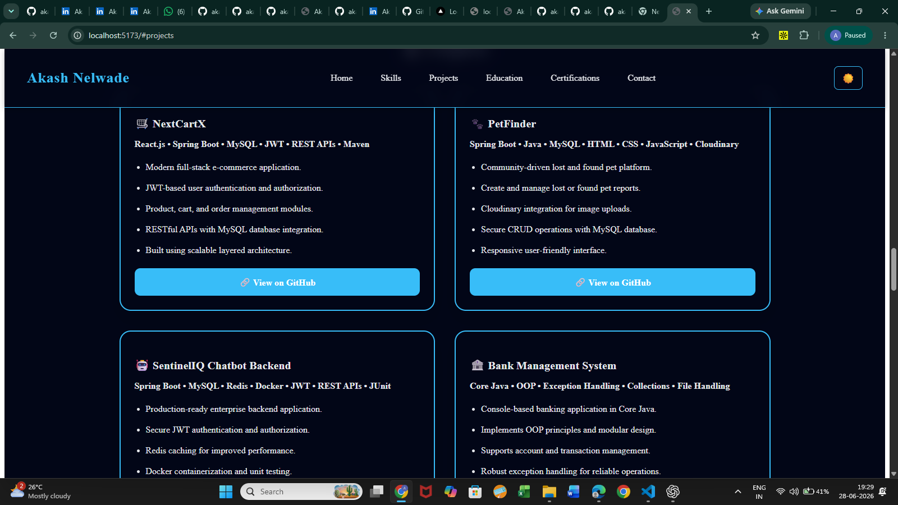
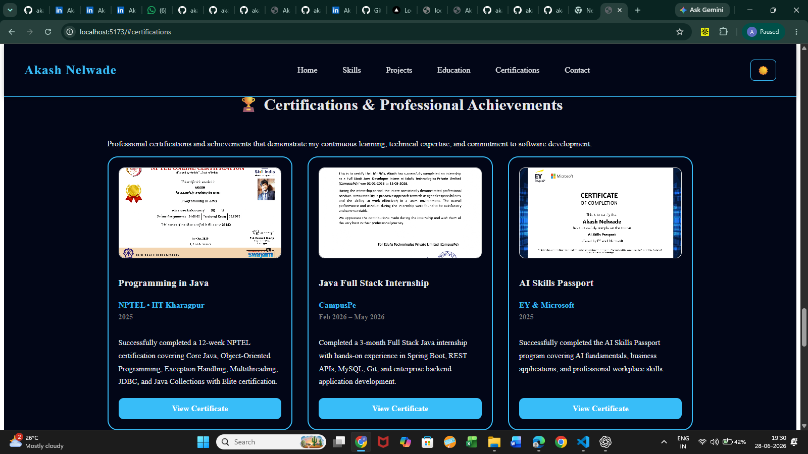

# Akash Nelwade Portfolio

A modern, responsive developer portfolio built with **React.js** to showcase my skills, projects, education, certifications, and professional journey as a Java Full Stack Developer.

---

## 📌 Overview

This portfolio serves as my personal website, highlighting my technical expertise, featured projects, certifications, and contact information. It is designed with a clean, responsive interface and follows modern web development practices.

---

## ✨ Features

- Responsive design for desktop, tablet, and mobile devices
- Dark & Light theme toggle
- Smooth scrolling navigation
- Skills showcase
- Featured projects section
- Education section
- Certifications section
- Contact form with API integration
- Clean and modern user interface

---

## 🛠 Tech Stack

### Frontend

- React.js
- JavaScript (ES6+)
- HTML5
- CSS3

### Development Tools

- Vite
- Git
- GitHub
- Chrome DevTools

---

## 📁 Project Structure

```text
src
├── components
│   ├── Navbar.jsx
│   ├── Home.jsx
│   ├── Skills.jsx
│   ├── Projects.jsx
│   ├── Education.jsx
│   ├── Certifications.jsx
│   └── Contact.jsx
│
├── styles
│   ├── navbar.css
│   ├── home.css
│   ├── skills.css
│   ├── projects.css
│   ├── education.css
│   ├── certifications.css
│   └── contact.css
│
├── App.jsx
└── main.jsx
````

---

## 🚀 Getting Started

### Clone the repository

```bash
git clone https://github.com/akashnelwade/react-portfolio.git
```

### Navigate to the project

```bash
cd react-portfolio
```

### Install dependencies

```bash
npm install
```

### Start the development server

```bash
npm run dev
```

### Build for production

```bash
npm run build
```

---

## 📷 Screenshots

### 🏠 Skills Section





---

### 💼 Projects Section



---

### 🏆 Certifications Section



## 🔮 Future Improvements

* Add project filtering
* Improve animations
* Add blog section
* Performance optimization
* SEO enhancements

---

## 👨‍💻 Author

**Akash Nelwade**

Aspiring Java Full Stack Developer passionate about building scalable, responsive, and user-friendly web applications using Java, Spring Boot, React.js, and MySQL.

---

## 📬 Connect With Me

**GitHub**

https://github.com/akashnelwade

**LinkedIn**

https://linkedin.com/in/nelwade-akash

---

## ⭐ Support

If you found this project helpful, consider giving it a ⭐ on GitHub.


